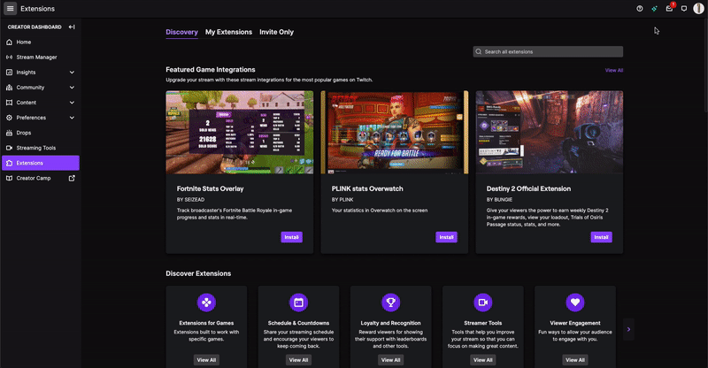
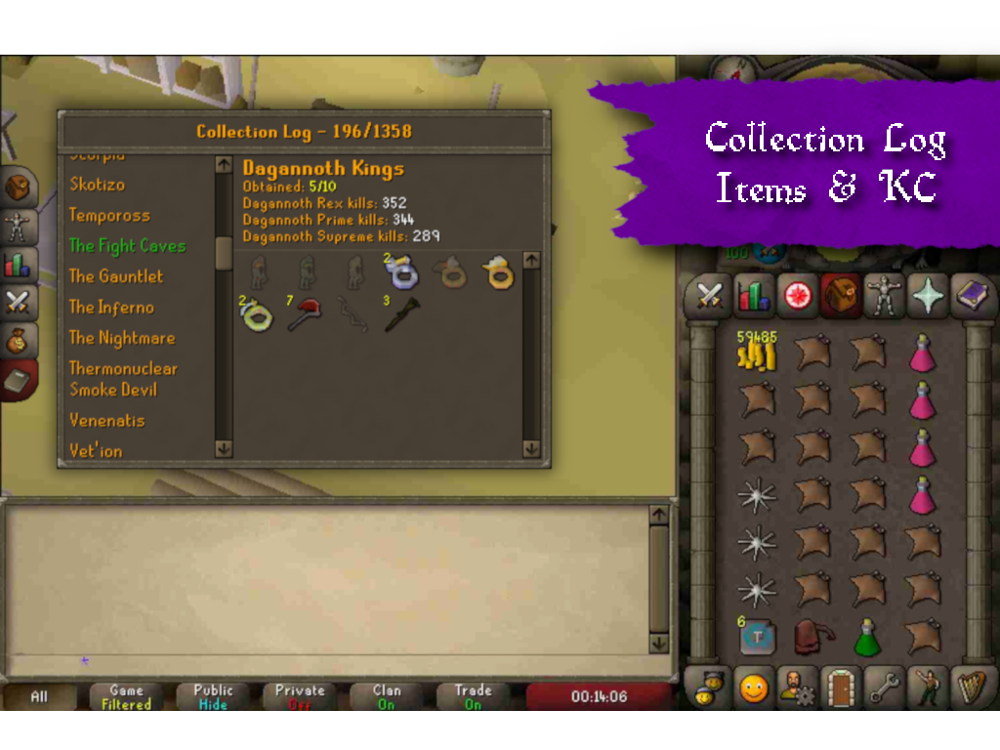
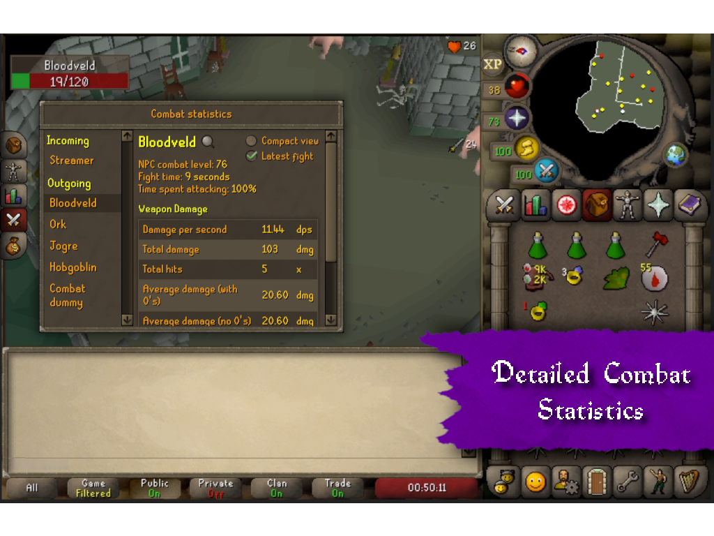
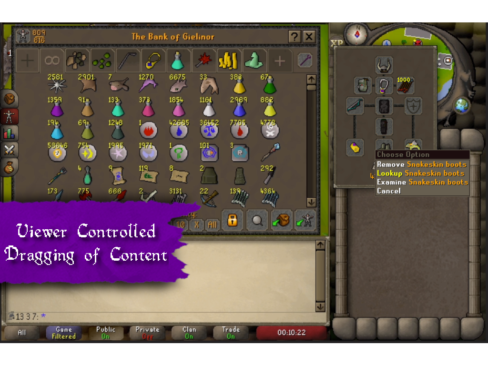
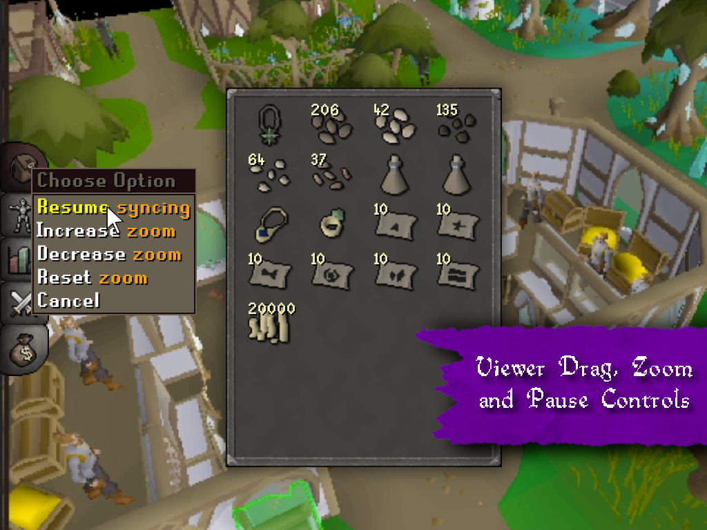

# OSRS Twitch Live Loadout Plugin  

Join the Discord server for questions or feature requests: 

Visit the landing page for more information: 
[http://liveloadout.com/](http://liveloadout.com/)

## Introduction

*"What is that helm you are wearing?!"*

Let your Twitch viewers be fully immersed by showing them interactive and live information about `Worn Equipment`, `Collection Log`, `Combat Statistics`, `Skills`, `Inventory`, `Bank`, `Looting Bag`, `Tombs of Amascut Invocations` and more!

## 🚀 Getting Started

### Requirements
- [Runelite Client](https://runelite.net/)
- [Twitch Account](https://www.twitch.tv/)

### Quick guide
- Step 1: Install [RuneLite Twitch Live Loadout Plugin](https://runelite.net/plugin-hub/Pepijn%20Verburg)
- Step 2: Install [Twitch OSRS Live Loadout Extension](https://dashboard.twitch.tv/extensions/cuhr4y87yiqd92qebs1mlrj3z5xfp6)
- Step 3: Copy token from the `Twitch Extension configuration page` and paste in the RuneLite plugin setting `Twitch Extension Token`.
- Step 4: Verify whether data is synced by previewing it in the `Twitch Extension configuration page`.

⚠️ Note that for the `collection log`, `bank`, `looting bag` and `ToA invocations` to show you need to **open them** at least once. They will all be stored locally so when you open RuneLite and login with the same account all will be synced again.

### Step 1: Install Runelite Plugin
You can install this plugin from the [Plugin Hub](https://runelite.net/plugin-hub/show/twitch-live-loadout).

The Plugin Hub can be found all the way to the bottom of your RuneLite plugins:

### Step 2: Install Twitch Extension
The [OSRS Live Loadout Extension](https://dashboard.twitch.tv/extensions/cuhr4y87yiqd92qebs1mlrj3z5xfp6) is available via the `Creator Dashboard` in your Twitch account. Make sure to set the extension to `Overlay 1` as well.

### Step 3: Copy Twitch Extension token for authentication
Now open the `Configuration view` by clicking on the `settings/cog icon`. Here you can preview what the extension looks like. The `Settings tab` opens automatically where you can copy an Extension Token that you need to authenticate RuneLite to send data to the extension. Below you can see a GIF of how to copy that over:

Note that the token is **valid for quite a long time**, meaning it is important you don't share the token with anyone. The RuneLite plugin panels show the validity of the token.

### Step 4: Test if everything works
Make sure you have something in your inventory or equipment to test with. Via the `Configuration view` of the extension you can also verify whether data is now synced, for example your gear:

## Changelog

#### v1.1.0
- Tombs of Amascut Invocations can now be synced automatically when at the raid lobby and in the raid itself.
- You can now switch between dark and light theme for your viewers.
- Added automatic detection of which RuneLite window and account should be synced to Twitch.
- All bank items are now synced to your viewers, rather than only the 200 most valuable items.
- The looting bag can now be synced to viewers.
- Items can now have 'special behaviours' for example the looting bag opens a new side-panel as one of the first items for this behaviour.
- Collection log can be filtered using keywords to chose what you want too sync.
- Added support and documentation links to the `Status` tab in the plugin tab.
- Added automatic detection which account should be synced when multi-logging. The plugin keeps track of which RuneLite window is focussed on for a minimum (configurable) time to determine which account to sync.
- Expanded the `Status` tab to be more transparent in which RuneLite window is currently synchronizing data.
- Enhanced the stability of the plugin by ignoring game events that are disabled by the streamer to sync anyways.

#### v1.0.3
- Patch to be compatible with the new RuneLite hitsplats API.

#### v1.0.2
- Collection log is now available to be viewed live by your viewers!
- Enhanced stability of plugin when there are breaking client or Twitch changes.
- The Twitch data syncing has been updated to work again due to deprecated functionalities.

## Features
Below you can find an overview which features are implemented. Most data is automatically synced when logged in. The `Bank` and `Collection Log`, `Looting Bag` and `ToA Invocations` are exceptions. See the ⚠️ marks below for an explanation.

  

### 🎒 Items
- [x] `Inventory items`: live view of the inventory and total price.
- [x] `Equipment items`: live view of worn gear and total price.
- [x] `Collection log`: the collection log including all items and kill counts.
- [x] `Bank items`: all bank items and total price.
- [x] `Bank tabs`: info what items are in what tab.
- [x] `Looting bag`: items inside the looting bag.
- [x] `Wiki lookup`: all items can be looked up by opening the official Wiki.

#### Bank
⚠️ The bank needs to `opened at least once after logging in` for the data to be retrieved by the plugin.

#### Collection Log
⚠️ Please note that you need to `open the collection log on each page` (e.g. each boss, each minigame, etc.) with the RuneLite plugin enabled to retrieve all the data so it can be synced with Twitch. This data is then `stored in your RuneLite profile` to be used in future sessions, so you don't have to do this every time you login 😄. When you want to update the KC or items, you need to `re-open the collection log` on the page of the boss / drop in question.

### 🥊 Combat
- [x] `Fight tracking`: general combat stats for multiple fights for both *PvM* & *PvP*.
- [x] `Kill tracking`: how many kills and separate stats for *all kills* and the *last kill*.
- [x] `DPS in general`: damage per seconds for all damage done to enemies.
- [x] `Poison damage`: poison and venom damage.
- [x] `Smite damage`: damage per fight smite has done including (hypothetical) prayer drain.
- [x] `Spell splashes`: count the splashes done on enemies (single combat only).
- [x] `Freezes`: count potential freezes and misses (single combat only).
- [x] `Entangle`: count snare/bind/entangle spells and misses (single combat only).
- [x] `Blood spell heals`: count potential heals through blood spells (single combat only).
- [x] `Incoming hits`: damage, splashes, etc. are also tracked on the logged in player.
- [x] `Wiki / Highscore lookup`: enemies can be looked up on the Wiki for NPC's and Highscores for players.

### 📊 Skills
- [x] `Skill experiences`: all experience amounts per skill.
- [x] `Skill levels`: current skills levels based on boosts.

#### 🛕 Raids
⚠️ The ToA invocations screen need to be opened at least once for RuneLite to read the data.

- [x] `ToA Invocations`: enabled and disabled invocations
- [x] `ToA Raid Level`: the current raid level

### 📝 General
- [x] `Player weight`: weight of worn and carried items including weight reducing items.
- [x] `Display name`: the name of the player in the chat bar.

### Twitch Extension specific
There are also some features available for the viewer in the [OSRS Live Loadout Extension](https://dashboard.twitch.tv/extensions/cuhr4y87yiqd92qebs1mlrj3z5xfp6).

## Settings & Panels

###  Panels

#### Status
The plugin also lets you see the current status of the connection with Twitch.

#### Fights
It is also possible to reset specific or all fights to let your statistics start from scratch.

### ⚙️ Settings
It is also possible to configure what information is being sent through the following options available in the plugin settings:

#### Twitch Extension & Token
- `Twitch extension token`: the login token specifically for the Twitch Extension you want to send the data to. This authenticates RuneLite to change data in the extension. This token should be retrieved when configuring the extension in the online Twitch interface.
- `Overlay top position`: The percentage from the top of the left side of the screen where the navigation should be placed.
- `Twitch Extension Themez`: Light or dark theme for the side panel your viewers see on Twitch.

#### Data Syncing
- `Sync enabled`: toggle off to disable all syncing and clear current data with all viewers.
- `Stream delay`: delay the synchronization with x amount of seconds to match the broadcaster video & audio delay. Also use this to tweak when the video is delayed due to general networking.

#### Anti Multi Logging
There are built-in measures to prevent different accounts to be synced to twitch at the same time due to multi logging (e.g. alts). The plugin checks which RuneLite window is focussed on for a minimum required time and then sends over the data of that account.

- `Active time check enabled`: enable when you want to determine which account to sync automatically based on which RuneLite window is focussed on.
- `Active time to sync (seconds)`: the minimum amount of time in seconds the RuneLite window needs to be in focus to start syncing data.

#### Items
- `Sync inventory items`: enable to sync inventory items.
- `Sync equipment items`: enable to sync equipment items.
- `Sync bank items`: enable to sync bank items.
- `Max bank items`: the maximum amount of bank items you would like to show (most valuable ones are prioritized).
- `Sync bank value`: enable to sync total bank value.
- `Sync looting bag`: enable to sync looting bag items.
- `Sync looting bag value`: enable to sync looting bag value.
- `Sync collection log`: enable to sync collection log.
- `Collection log filter`: Only include entry titles that include one of the keywords separated with a comma. For example `raids, abyssal, clue` will include the whole Raids tab (with CoX and ToB), the Abyssal Sire and all clue related categories.

#### Combat
- `Sync combat statistics`: enable to sync combat statistics.
- `Track magic spells`: enable tracking of freezes, entangles, blood spells and splashes.
- `Track damage by others`: enable tracking of hitsplats of other players.
- `Track un-attacked enemies`: enable tracking of hitsplats on enemies you have not attacked, recommended in team settings such as Cox and ToB. Note that the enemy type should be attacked at least once. So for example: once you have attacked a goblin it will be in your combat stats. If then other players attack a different goblin you haven't attacked yet it will add to the damage by others stats.
- `Max combat fights`: the maximum amount of fights tracked with an upper limit set by the plugin.
- `Fight expiry time`: reset a fight after the configured minutes of inactivity.
- `Auto idling of fight timer`: stop fight timer when logged out or enemy is not visible.

#### Raids
- `Sync ToA Invocations`: enable to sync Tombs of Amascut invocations.
- `Sync ToA Raid Level`: enable to sync Tombs of Amascut raid level.
- `Only Sync in ToA Raid`: enable to only sync ToA invocations and raid level when inside the raid lobby or inside of the raid.

#### Skills
- `Sync skill levels`: enable to sync (boosted) skills.
- `Virtual levels enabled`: when enabled the maximum level shown based on experience is 126 instead of 99.

#### General info
- `Sync display name`: enable to show basic player info.
- `Sync weight of carried items`: enable to sync weight.

## 🔒 Security & Technical Details

### Data Flow

#### Twitch as the only third-party
**All data is send directly to Twitch** to make sure no other third-parties receive any information. When a change happens due to in-game activity an update message is sent to the [Twitch PubSub Service](https://dev.twitch.tv/docs/extensions/reference/#send-extension-pubsub-message). This message is used to update the extension for the current viewers. General documentation about Twitch Extensions can be found [here](https://dev.twitch.tv/docs/extensions/reference/
).

#### Twitch Extension Token
It is worth noting that the token retrieved from Twitch to authenticate this plugin can **only access features related to the extension**. Twitch did a good job in preventing extensions and their tokens to have access outside of the extension (like controlling your Twitch account).

#### Diagram

### Technical Limitations
To simplify the state management one large state object is being send to Twitch. However, the Twitch Configuration and PubSub Service only allow messages of a *maximum size of 5KB*. This is also the reason why you can see the bank and collection log incrementally grow bigger for viewers. They are sent over in smaller parts and merged together later. All messages are compressed using a GZIP compression algorithm to maximize the use of available bytes.

### State update frequency
The state updates are dependant on the maximum amount allowed by Twitch. Rate limit documentation can be found [here](https://dev.twitch.tv/docs/api/guide/#rate-limits). Currently the maximum update frequency is is once per two seconds. This means the updates are never truly 'real-time'.

### Oldschool weekly updates
The plugin is implemented with the OSRS weekly updates in mind. There are few dependencies on specific content meaning that almost all updates are directly reflected in the plugin as well. For example external item caches are used to make sure item icons and names are directly up to date. This allows for lower maintenance of this plugin and less down-time or faulty behaviour.

This also works for the collection log. A thing to note here is that if you want any new collection log items shown you need to open the collection log interface at that boss / category at least once.

## 👥 Acknowledgements
Shout-out to the RuneLite team and many streamers providing valuable feedback and suggestions 🙌

## 💡 Feedback
If you have any questions or suggestions please join the [OSRS Live Loadout Discord](https://discord.gg/3Fjm5HTFGM) or open an issue here at Github.

## Copyright notice
Created using intellectual property belonging to Jagex Limited under the terms of Jagex's Fan Content Policy. This content is not endorsed by or affiliated with Jagex.
