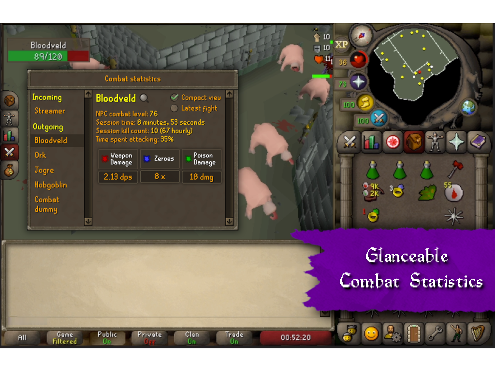
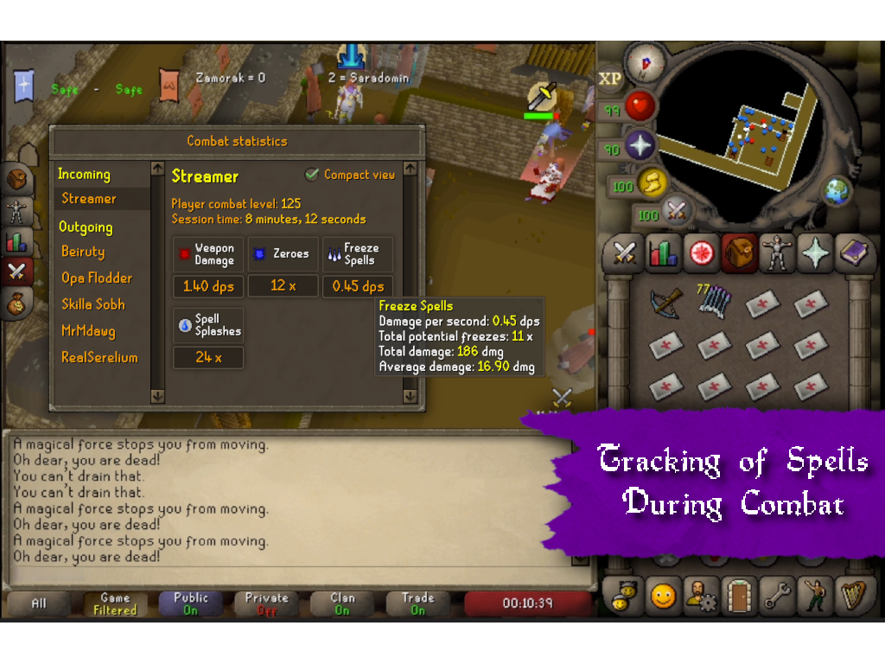
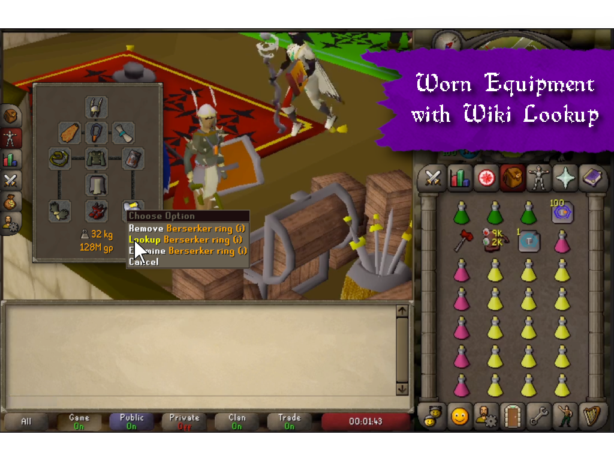
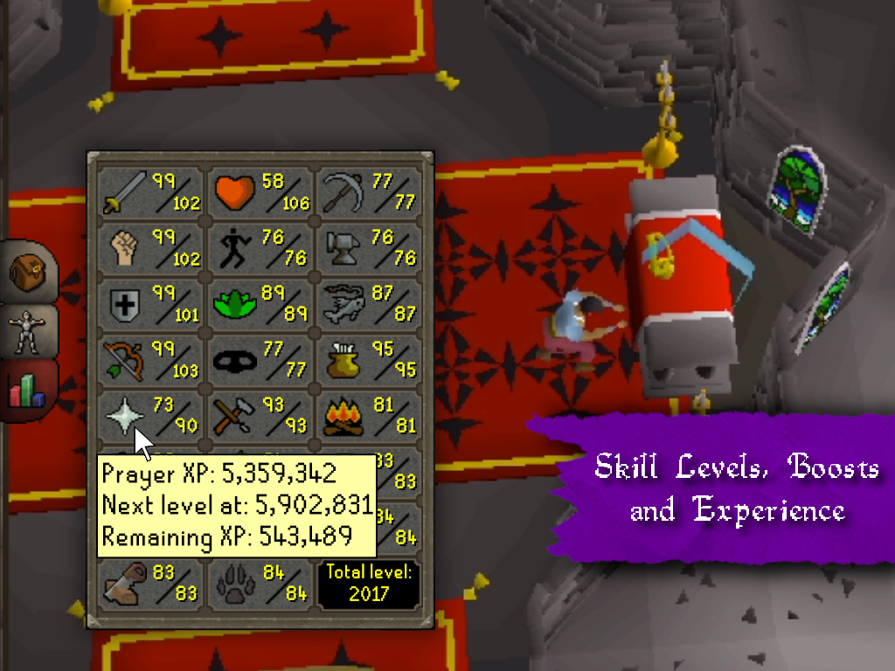
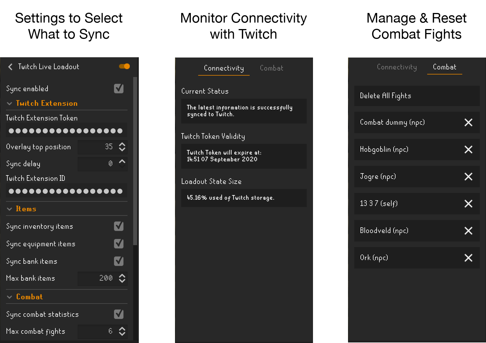

# OSRS Twitch Live Loadout Plugin

*"What is that helm you are wearing?!"*

Let your Twitch viewers be fully immersed by providing them with interactive and real-time information about `Worn Equipment`, `Combat Statistics`, `Skills`, `Inventory`, `Bank` and more! 

Get better engagement with...
- **New players** who are not familiar with most of the content.
- **Existing casual players** who are not up-to-date about the latest changes. 
- **Existing frequent players** who would like to give advice on the loadout. 

[Twitch Extensions](https://www.twitch.tv/p/extensions/) allow this data to be displayed live to each individual player while giving them control what to see and what to interact with.

## Requirements
- [Runelite Client](https://runelite.net/) with Plugin Hub enabled
- [Twitch Account](https://www.twitch.tv/) as broadcaster
- [OSRS Live Loadout Twitch Extension](https://dashboard.twitch.tv/extensions/cuhr4y87yiqd92qebs1mlrj3z5xfp6-0.0.1)

#### Client Settings
Within the client the following should be enabled for all features to work:
- Enable fake XP Drops via the OSRS settings (used for combat statistics).
- Enable tinted hitsplats via the OSRS settings (used for combat statistics).

## 🚀 Getting Started

### Runelite Plugin
You can install this plugin from the [Plugin Hub](https://runelite.net/plugin-hub/).

### Twitch Extension
This plugin is implemented in such a way any Twitch Extension can use the synchronized information. A list below is available to show what Twitch Extensions can be used with this plugin:

#### 1. OSRS Live Loadout
The [OSRS Live Loadout Extension](https://dashboard.twitch.tv/extensions/cuhr4y87yiqd92qebs1mlrj3z5xfp6-0.0.1) is directly compatible. You should add this extension to your Twitch account first to get the proper Twitch token to authenticate the Runelite plugin.

## Features
Below you can find an overview which features are implemented and which ones are still in progress. Note that the screenshots shown are from the [OSRS Live Loadout Extension](https://dashboard.twitch.tv/extensions/cuhr4y87yiqd92qebs1mlrj3z5xfp6-0.0.1). The use of other Twitch Extensions cause it to look differently.

   

### 🥊 Combat
- [x] `Fight tracking`: general combat stats for multiple fights for both *PvM* & *PvP*.
- [x] `Kill tracking`: how many kills and separate stats for *all kills* and the *last kill*.
- [x] `DPS in general`: damage per seconds for all damage done to enemies.
- [x] `Poison damage`: poison and venom damage.
- [x] `Smite damage`: damage per fight smite has done including (hypothetical) prayer drain.
- [x] `Spell splashes`: count the splashes done on enemies (single combat only).
- [x] `Freezes`: count potential freezes and misses (single combat only). 
- [x] `Entangle`: count snare/bind/entangle spells and misses (single combat only).
- [x] `Blood heals`: count potential heals through blood spells (single combat only).
- [x] `Incoming hits`: damage, splashes, etc. are also tracked on the logged in player.
- [x] `Wiki / Highscore lookup`: enemies can be looked up on the Wiki for NPC's and Highscores for players.
- [ ] `DPS per attack type`: show DPS per for ranged, magic and melee separately.

### 🎒 Items
- [x] `Inventory items`: live view of the inventory and total price.
- [x] `Equipment items`: live view of worn gear and total price.
- [x] `Bank items`: Top 200 most valuable bank items and price of all bank items (not all due to Twitch Extension limitations).
- [x] `Bank tabs`: info what items are in what tab.
- [x] `Wiki lookup`: all items can be looked up by opening the official Wiki.

### 🎯 Goals
- [ ] `Item goals`: overview of the items that one has a goal now. The completion will automatically update when an item has been obtained.
- [ ] `Item goals with KC`: for each item goal a boss killcount can be attached that is visible on hover.  

### 📊 Skills
- [x] `Skill experiences`: all experience amounts per skill.
- [x] `Skill levels`: current skills levels based on boosts.

### 📝 General
- [x] `Player weight`: weight of worn and carried items including weight reducing items.
- [x] `Display name`: the name of the player in the chat bar.

## Settings & Panels

### 🔲 Panels

#### Twitch Connectivity
The plugin also lets you see the current status of the connection with Twitch.

#### Combat Fight Management
It is also possible to reset specific or all fights to let your statistics start from scratch.

### ⚙️ Settings
It is also possible to configure what information is being sent through the following options available in the plugin settings:
- `Sync enabled`: toggle off to disable all syncing and clear current data with all viewers.
- `Twitch extension token`: the login token specifically for the Twitch Extension you want to send the data to. This authenticates RuneLite to change data in the extension. This token should be retrieved when configuring the extension in the online Twitch interface.
- `Overlay top position`: tweak where a Twitch Extension overlay would be positioned to match your screen layout.
- `Sync delay`: delay the synchronization with x amount of seconds to match the broadcaster video & audio delay. Also use this to tweak when the video is delayed due to general networking.
- `Twitch Extension ID`: the unique identifier of the Twitch Extension where the data should be sent to. This is pre-filled with an extension known to work well with this plugin.
- `Sync inventory items`: toggle to sync inventory items.
- `Sync equipment items`: toggle to sync equipment items.
- `Sync bank items`: toggle to sync bank items.
- `Max bank items`: the maximum amount of bank items with an upper limit set by the plugin.
- `Sync combat statistics`: toggle to sync combat statistics.
- `Track magic spells`: Enable tracking of freezes, entangles, blood spells and splashes.
- `Track damage by others`: Enable tracking of hitsplats of other players.
- `Max combat fights`: the maximum amount of fights tracked with an upper limit set by the plugin.
- `Fight expiry time`: reset a fight after the configured minutes of inactivity.
- `Sync skill levels`: toggle to sync (boosted) skills.
- `Virtual levels enabled`: when enabled the maximum level shown based on experience is 126 instead of 99. 
- `Sync display name`: toggle to show basic player info.
- `Sync weight of carried items`: toggle to sync weight.

## 🔒 Security & Technical Details

### Data Flow

#### Twitch as the only third-party
**All data is send directly to Twitch** to make sure no other third-parties receive any information. This is using the [Twitch Configuration Service](https://dev.twitch.tv/docs/tutorials/extension-101-tutorial-series/config-service) to store a persistent state of the above data. This persistent state is used to load the extension with the latest data when a new viewer opens the stream. When a change happens due to in-game activity an update message is sent to the [Twitch PubSub Service](https://dev.twitch.tv/docs/extensions/reference/#send-extension-pubsub-message). This message is used to update the extension for the current viewers. General documentation about Twitch Extensions can be found [here](https://dev.twitch.tv/docs/extensions/reference/
).

#### Twitch Extension Token
It is worth noting that the token retrieved from Twitch to authenticate this plugin can **only access features related to the extension**. Twitch did a good job in preventing extensions and their tokens to have access outside of the extension.

#### Diagram

### Technical Limitations
To simplify the state management one large state object is being send to Twitch. However, the Twitch Configuration and PubSub Service only allow messages of a *maximum size of 5KB*. This is also the reason why for the bank items only the top 200 most valuable items are synchronized. All messages are compressed using a GZIP compression algorithm to maximize the use of available bytes.

### State update frequency
The state updates are dependant on the maximum amount allowed by Twitch. Rate limit documentation can be found [here](https://dev.twitch.tv/docs/api/guide/#rate-limits). Currently the maximum update frequency is is once per two seconds. This means the updates are never truly 'real-time'.

### Oldschool weekly updates
The plugin is implemented with the OSRS weekly updates in mind. There are no dependencies on specific content meaning that all updates are directly reflected in the plugin as well. This allows for lower maintenance of this plugin and less down-time or faulty behaviour.

## 🔮 Future
Future features that might be added based on feedback are:
- [ ] List of current goal items with automatic progress based on items in bank/inventory/equipment.
- [ ] More in-depth statistics of PvP & PvM fights (e.g. `DPS`, `pray flicks`, etc.).
- [ ] Interface style choice (e.g. `old` / `2007` / `2012+` menu items).
- [ ] If the full bank is important, complex state management is considered where the bank is incrementally sent to Twitch in payloads of 5KB in size.
- [ ] Check whether different locations of viewers on the world influence the delay between video an updates so significantly that we would need to have a time reference to know when to update for each viewer independently.
- [ ] Add clan members to the fight stats to display the damage they are taking. They can then also be part of the 'incoming' fights group.
- [ ] Add live gear of PvP enemies deduced from graphical models.
- [ ] Sync data from loot tracker. Possible to have directly via API instead of via Twitch data packets?
- [ ] Let viewers 'vote' on wearing/dropping certain items by clicking on the items in question.
- [ ] Keep track of the last +/- 5 combat hits and show that in the combat stats tab (e.g. nice for KO hits).

## 💡 Feedback
If you have any questions or suggestions please contact `support@osrs-tools.com` or open an issue here at Github.