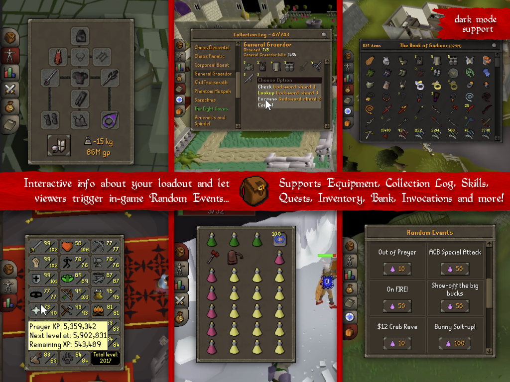
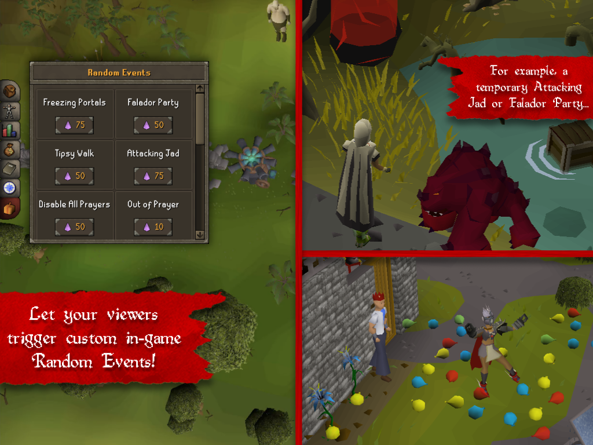
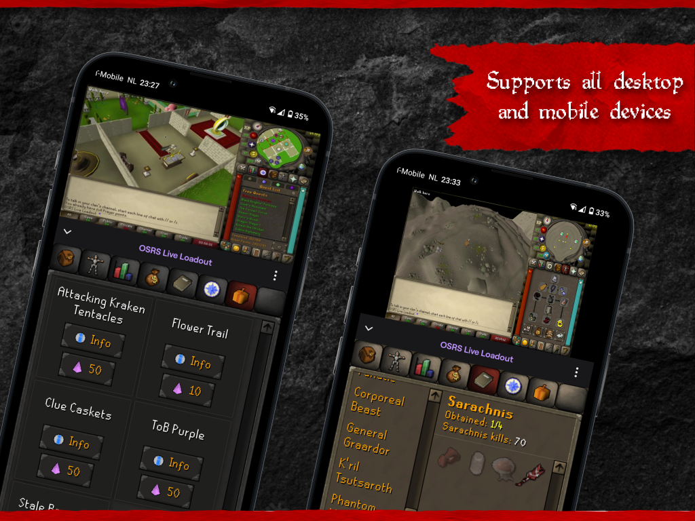

# OSRS Twitch Live Loadout Plugin  

Join the Discord server for questions or feature requests: 

Visit the landing page for more information: 
<a href="http://liveloadout.com/" target="_blank">http://liveloadout.com/</a>

## Introduction
Let your Twitch viewers be fully immersed by showing them interactive and live information about `Equipment`, `Collection Log`, `Combat Statistics`, `Skills`, `Inventory`, `Bank`, `Quests`, `Looting Bag`, `Tombs of Amascut Invocations` and more!

Optionally engage with gameplay by letting viewers trigger custom `Random Events`. There are many `Random Events` available by default channel exclusive ones can be requested in the [Discord](https://discord.gg/3Fjm5HTFGM).

## ✨ Features

#### 🎒 Syncing Loadout to viewers

#### ⚡️ Viewer triggered Random Events

#### 📱🖥 Cross-platform support

## 🚀 Getting Started

### Requirements
- [Runelite Client](https://runelite.net/)
- [Twitch Account](https://www.twitch.tv/)

### Quick guide
- Step 1: Install [RuneLite Twitch Live Loadout Plugin](https://runelite.net/plugin-hub/Pepijn%20Verburg)
- Step 2: Install [Twitch OSRS Live Loadout Extension](https://dashboard.twitch.tv/extensions/cuhr4y87yiqd92qebs1mlrj3z5xfp6)
- Step 3: Copy token from the `Twitch Extension configuration page` and paste in the RuneLite plugin setting `Your copied Twitch Extension Token`.
- Step 4: Verify whether data is synced by previewing it in the `Twitch Extension configuration page`.

⚠️ Note that for the `collection log`, `bank`, `looting bag` and `ToA invocations` to show you need to **open them at least once**. Their information is stored in your RuneLite profile so on your next session you wont need to open them again.

### Step 1: Install Runelite Plugin
You can install this plugin from the [Plugin Hub](https://runelite.net/plugin-hub/show/twitch-live-loadout).

https://github.com/pepijnverburg/osrs-runelite-twitch-live-loadout-plugin/assets/15874104/e22429a0-ede7-4f56-b740-7db0b23097d5

### Step 2: Install Twitch Extension
The [OSRS Live Loadout Extension](https://dashboard.twitch.tv/extensions/cuhr4y87yiqd92qebs1mlrj3z5xfp6) is available via the `Creator Dashboard` in your Twitch account. Make sure to set the extension to `Overlay 1` as well.

https://github.com/pepijnverburg/osrs-runelite-twitch-live-loadout-plugin/assets/15874104/f285ccbd-adc6-4c56-ba74-edac208729e8

### Step 3: Copy Twitch Extension token for authentication
Now open the `Configuration view` by clicking on the `configure` no the extension page. Here you can preview what the extension looks like. The `Settings tab` opens automatically where you can copy an Extension Token that you need to authenticate RuneLite to send data to your stream.

https://github.com/pepijnverburg/osrs-runelite-twitch-live-loadout-plugin/assets/15874104/5ff485d8-2178-427c-a5f8-51f90ae2a640

Note that the token is **valid for a long time**, meaning it is important you don't share the token with anyone. The RuneLite plugin panel shows the validity of the token.

### Step 4: Test if everything works
Make sure you have something in your inventory or equipment to test with. Via the `Configuration view` of the extension you can now verify whether data is synced, for example changes to your inventory:

https://github.com/pepijnverburg/osrs-runelite-twitch-live-loadout-plugin/assets/15874104/af71e762-f9e6-401a-88db-761386869a62

## 📄 Further reading

| Description  | Link |
| ------------- | ------------- |
| What has changed throughout the updates  | [Changelog](./docs/changelog.md)  |
| Information about how your information is protected  | [Security and Technical Details](./docs/security.md) |

## 👥 Acknowledgements
Shout-out to the RuneLite team and many streamers providing valuable feedback and suggestions 🙌

## 💡 Feedback
If you have any questions or suggestions please join the [OSRS Live Loadout Discord](https://discord.gg/3Fjm5HTFGM) or open an issue here at Github.

## Copyright notice
Created using intellectual property belonging to Jagex Limited under the terms of Jagex's Fan Content Policy. This content is not endorsed by or affiliated with Jagex.
